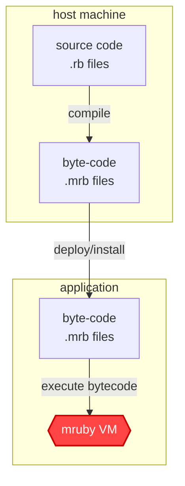

# ChibiRuby (netstandard2.0 backport)

> [!IMPORTANT]
> **This is an unofficial fork** that backports [hadashiA/ChibiRuby](https://github.com/hadashiA/ChibiRuby) to `netstandard2.0` (for .NET Framework 4.7.2+), originally with Claude Code (Opus 4.8).
> It is distributed via **GitHub Packages** under `MiguelJesus.*` package IDs — **not** on nuget.org. Published here: `MiguelJesus.ChibiRuby`, `MiguelJesus.ChibiRuby.Compiler`, and `MiguelJesus.ChibiRuby.Serializer` (plus their `MiguelJesus.ChibiRuby.Polyfills` dependency). For the CLI, Debugger, and Unity packages, use the [official upstream packages](https://www.nuget.org/profiles/hadashiA) on nuget.org.
> See [Installation → NuGet](#nuget) for how to configure the feed.

ChibiRuby is a pure C# implementation of the [mruby](https://github.com/mruby/mruby) virtual machine. It lets Unity and .NET applications run Ruby scripts with the performance and extensibility of modern C#.

It is useful for game scripting, embedded DSLs, scenario logic, and runtime-configurable behavior.

> [!NOTE]
> [VitalRouter.MRuby](https://github.com/hadashiA/VitalRouter) provides a high-level framework for integrating ChibiRuby with Unity (and .NET), including command routing and script lifecycle management.

> [!NOTE]
> The project has since been restarted as ChibiRuby; before v1.0, it was known as MRubyCS.

## Why mruby for scripting?

Ruby's clean, expressive syntax makes it perfect for building DSLs. Game designers and scenario writers can describe game logic — event triggers, dialogue trees, and AI behavior — in simple, readable scripts.

```ruby
# Example: game event DSL
with(:Yogoroza) do
  talk "Who are you?"
  motion :surprise
end

with(:BlackCat) do
  talk "It's you, isn't it."
  motion :laugh
  talk "You seem to be gradually forgetting who you are."
  talk "Isn't that right?"
end
```

> [!NOTE]
> [Presentation at RubyKaigi 2026](https://speakerdeck.com/hadashia/mruby-on-c-number-from-vm-implementation-to-game-scripting)

## Features

- Supports mruby 4.0 bytecode.
- **Pure C# mruby VM with zero native dependencies** — runs anywhere Unity/.NET runs. No per-platform native builds to maintain.
- **High performance** — leverages .NET JIT, GC, and modern C# optimizations with minimal overhead.
- **Ruby compatible** — all opcodes implemented; passes mruby's official test suite
  - [Syntax](https://github.com/hadashiA/ChibiRuby/blob/main/tests/ChibiRuby.Tests/ruby/test/syntax.rb), [Literals](https://github.com/hadashiA/ChibiRuby/blob/main/tests/ChibiRuby.Tests/ruby/test/literals.rb), [Lang](https://github.com/hadashiA/ChibiRuby/blob/main/tests/ChibiRuby.Tests/ruby/test/lang.rb), [Methods](https://github.com/hadashiA/ChibiRuby/blob/main/tests/ChibiRuby.Tests/ruby/test/methods.rb), [Module](https://github.com/hadashiA/ChibiRuby/blob/main/tests/ChibiRuby.Tests/ruby/test/module.rb), [Exception](https://github.com/hadashiA/ChibiRuby/blob/main/tests/ChibiRuby.Tests/ruby/test/exception.rb), ...
  - Supported classes/modules and their method signatures are published as RBS files under [`sig/`](https://github.com/hadashiA/ChibiRuby/tree/main/sig) — [`Array`](https://github.com/hadashiA/ChibiRuby/blob/main/sig/array.rbs), [`Hash`](https://github.com/hadashiA/ChibiRuby/blob/main/sig/hash.rbs), [`String`](https://github.com/hadashiA/ChibiRuby/blob/main/sig/string.rbs), [`Integer`](https://github.com/hadashiA/ChibiRuby/blob/main/sig/integer.rbs), [`Float`](https://github.com/hadashiA/ChibiRuby/blob/main/sig/float.rbs), [`Range`](https://github.com/hadashiA/ChibiRuby/blob/main/sig/range.rbs), [`Proc`](https://github.com/hadashiA/ChibiRuby/blob/main/sig/proc.rbs), [`Symbol`](https://github.com/hadashiA/ChibiRuby/blob/main/sig/symbol.rbs), [`Fiber`](https://github.com/hadashiA/ChibiRuby/blob/main/sig/fiber.rbs), [`Time`](https://github.com/hadashiA/ChibiRuby/blob/main/sig/time.rbs), [`Random`](https://github.com/hadashiA/ChibiRuby/blob/main/sig/random.rbs), [`Enumerable`](https://github.com/hadashiA/ChibiRuby/blob/main/sig/enumerable.rbs), [`Comparable`](https://github.com/hadashiA/ChibiRuby/blob/main/sig/comparable.rbs), etc.
  - Enumerable extensions (mruby-enum-ext): see [`sig/enumerable.rbs`](https://github.com/hadashiA/ChibiRuby/blob/main/sig/enumerable.rbs)
  - **Optional (opt-in)** — see [Optional Classes](#optional-classes-opt-in)
      - [`Regexp`](https://github.com/hadashiA/ChibiRuby/blob/main/sig/regexp.rbs) / [`MatchData`](https://github.com/hadashiA/ChibiRuby/blob/main/sig/match_data.rbs) (via `mrb.DefineRegexp()`)
      - [`IO`](https://github.com/hadashiA/ChibiRuby/blob/main/sig/io.rbs) / [`File`](https://github.com/hadashiA/ChibiRuby/blob/main/sig/file.rbs) / `IOError` (via `mrb.DefineIO()`)
- **Fiber & async/await integration** — suspend Ruby execution and await C# async methods without blocking threads.
- **Debugger (DAP)** — line breakpoints, stepping, locals view, and expression evaluation. Attach from VSCode / JetBrains / Zed to a running Unity or .NET host over TCP. See [Debugger](#debugger).
- **Prism-based compiler** — uses [mruby-compiler2](https://github.com/picoruby/mruby-compiler2), the next-generation mruby compiler built on [Prism](https://github.com/ruby/prism) (the official CRuby parser), for more accurate and modern Ruby syntax support.

## Quick Start

In a .NET project, first [configure the GitHub Packages feed](#nuget), then install the runtime and compiler packages:

```bash
dotnet add package MiguelJesus.ChibiRuby
dotnet add package MiguelJesus.ChibiRuby.Compiler
```

Then compile and execute Ruby source from C#:

```cs
using ChibiRuby;
using ChibiRuby.Compiler;

using var mrb = MRubyState.Create();
using var compiler = MRubyCompiler.Create(mrb);

var result = compiler.LoadSourceCode("""
    def fibonacci(n)
      return n if n <= 1
      fibonacci(n - 1) + fibonacci(n - 2)
    end

    fibonacci 10
    """u8);

Console.WriteLine(result.IntegerValue); // 55
```

For production builds, prefer compiling Ruby files to `.mrb` bytecode ahead of time:

```bash
dotnet tool install -g ChibiRuby.Cli
chibiruby compile fibonacci.rb -o fibonacci.mrb
```

## Performance

In the .NET JIT environment, execution speeds are equal to or faster than the original native mruby.


The above results were obtained on macOS with Apple M4 over 10 iterations.

Please refer to the following for the [benchmark code](https://github.com/hadashiA/ChibiRuby/tree/main/sandbox/ChibiRuby.Benchmark).

## Table of Contents

- [Installation](#installation)
    - [NuGet](#nuget)
    - [Unity](#unity)
- [Basic Usage](#basic-usage)
    - [Compiling and Executing Ruby Code](#compiling-and-executing-ruby-code)
        - [Option A: Pre-compile bytecode](#option-a-pre-compile-bytecode)
        - [Option B: Use the Compiler Library at Runtime](#option-b-use-the-compiler-library-at-runtime)
        - [Irep](#irep)
        - [Compiler Reference](#compiler-reference)
    - [Define Ruby classes, modules, and methods from C#](#define-ruby-classes-modules-and-methods-from-c)
        - [Error handling & validation in C# methods](#error-handling--validation-in-c-methods)
        - [Constants](#constants)
    - [Call Ruby Methods from C#](#call-ruby-methods-from-c)
        - [Send with block / keyword arguments](#send-with-block--keyword-arguments)
        - [Type conversion & introspection](#type-conversion--introspection)
        - [Instance variables / class variables / global variables](#instance-variables--class-variables--global-variables)
        - [Clone / Dup / Freeze](#clone--dup--freeze)
    - [MRubyValue](#mrubyvalue)
        - [Symbol/String](#symbolstring)
        - [Array/Hash](#arrayhash)
        - [Embedded custom C# data into MRubyValue](#embedded-custom-c-data-into-mrubyvalue)
- [Optional Classes (opt-in)](#optional-classes-opt-in)
    - [Regexp](#regexp)
    - [IO / File](#io--file)
- [Fiber (Coroutine)](#fiber-coroutine)
- [Define async Ruby method (FiberScheduler)](#define-async-ruby-method-fiberscheduler)
    - [Default behavior (no scheduler)](#default-behavior-no-scheduler)
    - [With a scheduler installed](#with-a-scheduler-installed)
    - [Defining async Ruby methods with `Await`](#defining-async-ruby-methods-with-await)
    - [Low-level: `Suspend` + `FiberContinuation`](#low-level-suspend--fibercontinuation)
    - [Unity (`UnityFiberScheduler`)](#unity-unityfiberscheduler)
    - [Custom Schedulers (subclassing)](#custom-schedulers-subclassing)
- [Debugger](#debugger)
    - [Host setup](#host-setup)
    - [Editor setup](#editor-setup) (VSCode / Rider / Zed)
    - [Setting breakpoints](#setting-breakpoints)
- [Serializer](#serializer)

## Installation

> [!WARNING]
> The current version supports mruby 4.0 bytecode.
> Versions 0.70.0 and older supported mruby 3.0 bytecode.
> If you have bytecode from an older ChibiRuby.Compiler (or mrbc), please regenerate it with the latest version.

### NuGet

This backport publishes to **GitHub Packages** (not nuget.org), under `MiguelJesus.*` IDs:

| Package                            | Description                                    |
|:-----------------------------------|:-----------------------------------------------|
| `MiguelJesus.ChibiRuby`            | Runtime package: a pure C# mruby VM.           |
| `MiguelJesus.ChibiRuby.Compiler`   | Ruby source compiler utility (native binding). |
| `MiguelJesus.ChibiRuby.Serializer` | Converts between Ruby and C# objects.          |
| `MiguelJesus.ChibiRuby.Polyfills`  | netstandard2.0 polyfills (transitive dependency — pulled in automatically). |

> [!NOTE]
> The library packages target `netstandard2.0` (alongside `net8.0`, `net9.0`, and `net10.0`), so they run on .NET Framework 4.7.2+ as well as modern .NET and Unity.
>
> The CLI tool, Debugger, Debugger.Dap, and Unity packages are **not** part of this backport feed — install those from the [official upstream packages](https://www.nuget.org/profiles/hadashiA) on nuget.org.

#### Configuring the GitHub Packages feed

GitHub Packages requires authentication to restore NuGet packages — **even for public packages** — so consumers must register the feed once with a [GitHub Personal Access Token](https://github.com/settings/tokens) that has the `read:packages` scope:

```bash
dotnet nuget add source "https://nuget.pkg.github.com/miguelkjesus/index.json" \
  --name miguelkjesus-github \
  --username <your-github-username> \
  --password <PAT-with-read:packages> \
  --store-password-in-clear-text
```

Alternatively, add a `nuget.config` next to your solution:

```xml
<?xml version="1.0" encoding="utf-8"?>
<configuration>
  <packageSources>
    <add key="miguelkjesus-github" value="https://nuget.pkg.github.com/miguelkjesus/index.json" />
  </packageSources>
  <packageSourceCredentials>
    <miguelkjesus-github>
      <add key="Username" value="%GITHUB_USERNAME%" />
      <add key="ClearTextPassword" value="%GITHUB_TOKEN%" />
    </miguelkjesus-github>
  </packageSourceCredentials>
</configuration>
```

After the feed is configured, install the packages:

```bash
dotnet add package MiguelJesus.ChibiRuby
dotnet add package MiguelJesus.ChibiRuby.Compiler
```

### Unity

> [!NOTE]
> Requirements: Unity 2021.3 or later.

> [!IMPORTANT]
> As of v0.107.0, ChibiRuby.Compiler is distributed via NuGetForUnity. Users of earlier versions should refer to this migration guide. [v0.107.0](https://github.com/hadashiA/ChibiRuby/releases/tag/0.107.0)

1. Install [NuGetForUnity](https://github.com/GlitchEnzo/NuGetForUnity) (v4.3.0 or later — required for native plugin support).
2. Install following packages via NuGetForUnity
    - Utf8StringInterpolation
    - ChibiRuby
    - (Optional) ChibiRuby.Compiler — runtime Ruby compiler. Native binaries (macOS, Linux, Windows, Android, iOS, WebGL) ship inside the NuGet package.
    - (Optional) ChibiRuby.Serializer
3. (Optional) For an Editor extension that auto-imports `.rb` / `.mrb` files as `TextAsset` subassets, install `ChibiRuby.Compiler` Unity package as well — see [Unity AssetImporter](#unity-assetimporter).

> [!NOTE]
> **For macOS Editor users**
>
> NuGetForUnity v4.3.0's default `NativeRuntimeSettings` ships broken Editor settings for the `osx-arm64` / `osx-x64` runtimes (the Apple Silicon variant has no Editor target, and the Intel variant defaults to "Any CPU"), so `libmruby.dylib` may fail to load in the Editor.
> A fix has been submitted upstream — [NuGetForUnity#755](https://github.com/GlitchEnzo/NuGetForUnity/pull/755). Once that is merged and released, this workaround will no longer be needed. In the meantime, fix the two dylibs from Unity's Inspector:
> 1. In the Project window, select `Assets/Packages/ChibiRuby.Compiler.*/runtimes/osx-arm64/native/libmruby.dylib`. In the Inspector, under **Platform settings → Editor**, check **Include Platforms → Editor**, set **CPU** to `ARM64`, set **OS** to `OSX`, then click **Apply**.
> 2. Select `Assets/Packages/ChibiRuby.Compiler.*/runtimes/osx-x64/native/libmruby.dylib`. In the Inspector, under **Platform settings → Editor**, **uncheck** Editor (or set **CPU** to `x86_64` and **OS** to `OSX` if you want it kept for Intel Editors), then click **Apply**.
> 3. Right-click each of the two `libmruby.dylib` files in the Project window and choose **Reimport**. NuGetForUnity skips reprocessing assets that already have its label, so the explicit reimport is required to apply the corrected Editor/CPU settings.

## Basic Usage

### Compiling and Executing Ruby Code

mruby allows the compiler and runtime to be separated. By distributing only precompiled bytecode, you can keep the mruby compiler out of your production deployment.



You can choose whether to deploy precompiled bytecode or raw source code:

- Bytecode only:
    - extremely compact and recommended for production environments.
- Source code:
    - compiled on the target machine.
    - Note that compilation relies on the native compiler, so supported platforms are limited to those where mruby-compiler runs.

> [!TIP]
> Option A is recommended for production. Option B is convenient for development and prototyping.

#### Option A: Pre-compile bytecode

Pre-compile Ruby source to `.mrb` bytecode with the CLI tool:

```bash
dotnet tool install -g ChibiRuby.Cli
chibiruby compile fibonacci.rb -o fibonacci.mrb
```

Or with the C# API:

```cs
using ChibiRuby;
using ChibiRuby.Compiler;

var mrb = MRubyState.Create();
var compiler = MRubyCompiler.Create(mrb);

var source = """
    def fibonacci(n)
      return n if n <= 1
      fibonacci(n - 1) + fibonacci(n - 2)
    end

    fibonacci 10
    """u8;

// Compile and save as .mrb file
using var compilation = compiler.Compile(source);
File.WriteAllBytes("fibonacci.mrb", compilation.AsBytecode());
```

Then execute the pre-compiled bytecode:

```cs
using ChibiRuby;

var mrb = MRubyState.Create();
var bytecode = File.ReadAllBytes("/path/to/fibonacci.mrb");
var result = mrb.LoadBytecode(bytecode);

result.IntegerValue //=> 55
```

#### Option B: Use the Compiler Library at Runtime

```bash
dotnet add package MiguelJesus.ChibiRuby
dotnet add package MiguelJesus.ChibiRuby.Compiler
```

```cs
using ChibiRuby;
using ChibiRuby.Compiler;

var mrb = MRubyState.Create();
var compiler = MRubyCompiler.Create(mrb);

var result = compiler.LoadSourceCode("""
    def fibonacci(n)
      return n if n <= 1
      fibonacci(n - 1) + fibonacci(n - 2)
    end

    fibonacci 10
    """u8);

result.IntegerValue //=> 55
```

See also [ChibiRuby.Compiler (library)](#chibirubycompiler-library) for installation details.

#### Irep

You can also parse bytecode in advance. The result is called `Irep` in mruby terminology. Pre-parsing is useful when you want to execute the same bytecode multiple times without re-parsing overhead.

```cs
Irep irep = mrb.ParseBytecode(bytecode);
mrb.Execute(irep);
```

`Irep` can be executed as is, or converted to `Proc`, `Fiber` before use. For details on Fiber, refer to the [Fiber](#fiber-coroutine) section.

> [!NOTE]
> - **`Dispose` when finished** — `MRubyState` is `IDisposable`. The VM itself has no unmanaged resources, but an installed `MRubyFiberScheduler` may hold cancellation tokens for parked fibers; `Dispose` cleans those up. A finalizer is in place as a backstop, but explicit disposal is preferred. If you never call `UseFiberScheduler`, omitting `Dispose` is harmless.
> - **Not thread-safe** — each `MRubyState` instance must be used from a single thread. For multi-threaded scenarios, create a separate instance per thread.

---

#### Compiler Reference

The ChibiRuby runtime is pure C#, but the mrb compiler uses the native prism compiler.
Note that the compiler's supported target platforms are subject to the following limitations.

##### ChibiRuby.Cli (dotnet tool)

The `chibiruby compile` CLI supports additional output formats beyond simple `.mrb`:

```bash
# Dump bytecode in human-readable format
$ chibiruby compile input.rb --dump

# Generate C# code with embedded bytecode
$ chibiruby compile input.rb -o Bytecode.cs --format csharp --csharp-namespace MyApp
```

> [!TIP]
> For local tool installation, use `dotnet tool install ChibiRuby.Cli` and run with `dotnet chibiruby compile`.

| Option | Description |
|:-------|:------------|
| `-o`, `--output` | Output file path (default: same directory as input with `.mrb`/`.cs` extension). Use `-` for stdout. |
| `--dump` | Dump bytecode in human-readable format (outputs to stdout) |
| `--format` | Output format: `binary` (default) or `csharp` |
| `--csharp-namespace` | C# namespace for generated code (used with `--format csharp`) |
| `--csharp-class-name` | C# class name for generated code (used with `--format csharp`) |

##### mrbc (original mruby compiler)

Alternatively, you can use the original [mruby](https://github.com/mruby/mruby) project's compiler.

```bash
$ git clone git@github.com:mruby/mruby.git
$ cd mruby
$ rake
$ ./build/host/bin/mrbc -o output.mrb input.rb
```

##### ChibiRuby.Compiler (library)

`ChibiRuby.Compiler` is a thin wrapper of the C# API for the native compiler.

NOTE: This is a wrapper for native compilers. Currently, the following platforms are supported:

| OS / Runtime | Architecture                           | .NET RID                                  |
|:-------------|:---------------------------------------|:------------------------------------------|
| Windows      | x64                                    | `win-x64`                                 |
| Linux        | x64, arm64                             | `linux-x64`, `linux-arm64`                |
| macOS        | x64, arm64                             | `osx-x64`, `osx-arm64`                    |
| Android      | arm64-v8a, x86_64                      | `android-arm64`, `android-x64`            |
| iOS          | arm64 (device + Apple Silicon simulator) | `ios-arm64`, `iossimulator-arm64`       |
| WebAssembly  | wasm32 (Unity WebGL / .NET Browser WASM) | `browser-wasm`                          |

```bash
dotnet add package MiguelJesus.ChibiRuby.Compiler
```

**Unity**: install the upstream `ChibiRuby.Compiler` via [NuGetForUnity](https://github.com/GlitchEnzo/NuGetForUnity) (v4.3.0 or later) — Unity consumption is not covered by this GitHub Packages backport. The native compiler binaries (`libmruby.dylib` / `.so` / `.dll`) are bundled in the NuGet package and resolved automatically.

If you also want the Editor extension that auto-imports `.rb` / `.mrb` files as `TextAsset` subassets, additionally install the Unity package. Open Window > Package Manager, click [+] > Add package from git URL, and enter:

```
https://github.com/hadashiA/ChibiRuby.git?path=src/ChibiRuby.Unity/Assets/ChibiRuby.Compiler.Unity#1.3.0
```

See [Unity AssetImporter](#unity-assetimporter) for details.

```cs
using ChibiRuby.Compiler;

var source = """
def f(a)
  1 * a
end

f 100
"""u8;

var mrb = MRubyState.Create();
var compiler = MRubyCompiler.Create(mrb);

// Compile source code (returns CompilationResult)
using var compilation = compiler.Compile(source);

// Convert to irep (internal executable representation)
var irep = compilation.ToIrep();

// irep can be used later..
var result = mrb.Execute(irep); // => 100

// Or, get bytecode (mruby calls this format "Rite")
// bytecode can be saved to a file or any other storage
File.WriteAllBytes("compiled.mrb", compilation.AsBytecode());

// Can be used later from file
mrb.LoadBytecode(File.ReadAllBytes("compiled.mrb")); //=> 100

// or, you can evaluate source code directly
result = compiler.LoadSourceCode("f(100)"u8);
result = compiler.LoadSourceCode("f(100)");
```

##### Unity AssetImporter

In Unity, if you install this extension, importing a .rb text file will generate .mrb bytecode as a subasset.

For example, importing the text file `hoge.rb` into a project will result in the following.


This subasset is a `TextAsset` that can be assigned via the inspector or loaded from code:

``` cs
var mrb = MRubyState.Create();

var bytecodeAsset = (TextAsset)AssetDatabase.LoadAllAssetsAtPath("Assets/hoge.rb")
       .First(x => x.name.EndsWith(".mrb"));
mrb.LoadBytecode(bytecodeAsset.GetData<byte>().AsSpan());
```

To read a subasset in Addressables, you would do the following.

```cs
Addressables.LoadAssetAsync<TextAsset>("Assets/hoge.rb[hoge.mrb]")
```

##### Hot reload in the Editor

Bundling pre-compiled `.mrb` bytecode via the importer is the production path, but it is **not** the only option.

In environments where ChibiRuby.Compiler is supported (macOS, Windows, Linux), it is possible to dynamically load .rb source code at any time, even while it is running.

- **Hot-reload Ruby scripts in Play Mode** — re-`LoadSourceCode` a modified `.rb` file without exiting Play Mode and reattaching the player.

```cs
using var compiler = MRubyCompiler.Create(mrb);
var src = File.ReadAllText(Path.Combine(Application.streamingAssetsPath, "scripts/player.rb"));
compiler.LoadSourceCode(src); // re-evaluates, replacing previous definitions
```

### Define Ruby classes, modules, and methods from C#

```cs
var classA = mrb.DefineClass(mrb.Intern("A"u8), c =>
{
    c.DefineMethod(mrb.Intern("plus100"u8), (_, self) =>
    {
        var arg0 = mrb.GetArgumentAsIntegerAt(0);
        return arg0 + 100;
    });
});
```

```ruby
a = A.new
a.plus100(123) #=> 223
```

#### Block / keyword / rest arguments

Methods can also receive blocks, keyword arguments, and rest arguments:

```cs
var classA = mrb.DefineClass(mrb.Intern("A"u8), c =>
{
    // Block argument
    c.DefineMethod(mrb.Intern("with_block"u8), (_, self) =>
    {
        var arg0 = mrb.GetArgumentAt(0);
        var blockArg = mrb.GetBlockArgument();
        if (!blockArg.IsNil)
        {
            mrb.Send(blockArg, mrb.Intern("call"u8), arg0);
        }
    });

    // Keyword and rest arguments
    c.DefineMethod(mrb.Intern("with_kwargs"u8), (_, self) =>
    {
        var keywordArg = mrb.GetKeywordArgument(mrb.Intern("foo"u8));
        mrb.EnsureValueType(keywordArg, MRubyVType.Integer);

        var restArguments = mrb.GetRestArgumentsAfter(0);
        for (var i = 0; i < restArguments.Length; i++)
        {
            Console.WriteLine($"rest arg({i}): {restArguments[i]}");
        }
    });
});
```

#### Class methods / modules

```cs
// Class method
var classA = mrb.DefineClass(mrb.Intern("A"u8), c =>
{
    c.DefineClassMethod(mrb.Intern("greet"u8), (_, self) =>
    {
        return mrb.NewString("hello"u8);
    });
});

// Monkey patching — add methods after class definition
classA.DefineMethod(mrb.Intern("extra"u8), (_, self) => { /* ... */ });

// Define module and include
var moduleA = mrb.DefineModule(mrb.Intern("ModuleA"u8));
mrb.DefineMethod(moduleA, mrb.Intern("module_method"u8), (_, self) => 123);
mrb.IncludeModule(classA, moduleA);
```

```ruby
A.greet          #=> "hello"
A.new.extra
A.new.module_method #=> 123
```

#### Error handling & validation in C# methods

Inside C#-defined methods, you can raise Ruby exceptions and validate arguments:

```cs
var myClass = mrb.DefineClass(mrb.Intern("MyClass"u8));

mrb.DefineMethod(myClass, mrb.Intern("safe_divide"u8), (s, self) =>
{
    s.EnsureArgumentCount(2, 2); // require exactly 2 arguments

    var a = s.GetArgumentAsIntegerAt(0);
    var b = s.GetArgumentAsIntegerAt(1);

    if (b == 0)
    {
        s.Raise(s.StandardErrorClass, "division by zero"u8);
    }
    return a / b;
});
```

```cs
// Available validation helpers
mrb.EnsureArgumentCount(min, max);               // check argument count
mrb.EnsureValueType(value, MRubyVType.Integer);  // check value type
mrb.EnsureBlockGiven(block);                     // check block is provided
mrb.EnsureNotFrozen(value);                      // check object is not frozen

// Raise Ruby exceptions
mrb.Raise(mrb.StandardErrorClass, "message"u8);
mrb.Raise(mrb.ExceptionClass, mrb.NewString($"detail: {info}"));
```

To catch Ruby exceptions raised during execution on the C# side:

```cs
try
{
    mrb.Send(obj, mrb.Intern("may_raise"u8));
}
catch (MRubyRaiseException ex)
{
    Console.WriteLine($"Ruby exception: {ex.Message}");
}
```

#### Constants

```cs
// Define a constant under Object (global)
mrb.DefineConst(mrb.Intern("MAX_SIZE"u8), 1024);

// Define a constant under a specific class/module
mrb.DefineConst(myClass, mrb.Intern("VERSION"u8), mrb.NewString("1.0"u8));

// Check if a constant exists
mrb.ConstDefinedAt(mrb.Intern("MAX_SIZE"u8));                         //=> true
mrb.ConstDefinedAt(mrb.Intern("VERSION"u8), myClass);                 //=> true
mrb.ConstDefinedAt(mrb.Intern("VERSION"u8), myClass, recursive: true); // search ancestors

// Safe lookup
if (mrb.TryGetConst(mrb.Intern("MAX_SIZE"u8), out var constValue))
{
    // use constValue...
}
```

### Call Ruby Methods from C#

Use `mrb.Send()` to call Ruby methods from C#:

```cs
// Call a class method
var classA = mrb.GetConst(mrb.Intern("A"u8), mrb.ObjectClass);
mrb.Send(classA, mrb.Intern("foo="u8), 123);
mrb.Send(classA, mrb.Intern("foo"u8)); //=> 123

// Call a global-scope method — use TopSelf as the receiver
mrb.Send(mrb.TopSelf, mrb.Intern("puts"u8), mrb.NewString("hello"u8));

// Access instance variables
var instanceB = mrb.GetInstanceVariable(mrb.TopSelf, mrb.Intern("@b"u8));
mrb.Send(instanceB, mrb.Intern("bar="u8), 456);
mrb.Send(instanceB, mrb.Intern("bar"u8)); //=> 456

// Resolve nested constants
var classC = mrb.Send(mrb.ObjectClass, mrb.Intern("const_get"u8), mrb.NewString("M::C"u8));
```

<details>
<summary>Ruby code assumed by the examples above</summary>

```ruby
class A
  def self.foo = @@foo

  def self.foo=(x)
    @@foo = x
  end
end

class B
  attr_accessor :bar
end
@b = B.new

module M
  class C
    def self.foo = 999
  end
end
```
</details>

#### Send with block / keyword arguments

```cs
// Send with a block (RProc)
var proc = mrb.CreateProc(irep);
mrb.Send(obj, mrb.Intern("each"u8), proc);

// Send with keyword arguments
mrb.Send(
    obj,
    mrb.Intern("configure"u8),
    args: [],
    kargs: [new(mrb.Intern("verbose"u8), MRubyValue.True)],
    block: null);
```

> [!WARNING]
> **Unity**: The `Send` overload with `params ReadOnlySpan<MRubyValue>` is not supported because Unity's C# compiler does not support `params ReadOnlySpan<T>`. You must explicitly allocate an array instead:
> ```cs
> // This does NOT compile in Unity:
> // mrb.Send(klass, sym, arg0, arg1);
>
> // Use an explicit array:
> mrb.Send(klass, sym, new MRubyValue[] { arg0, arg1 });
> ```
> The single-argument overload `Send(self, methodId, arg0)` works without this workaround.

#### Type conversion & introspection

The following examples use `value`, `a`, `b` as `MRubyValue` instances obtained from prior operations (e.g. `Send`, `LoadBytecode`).

```cs
// Convert values (calls Ruby's to_i / to_f / to_sym internally)
long   i = mrb.AsInteger(value);
double f = mrb.AsFloat(value);
Symbol s = mrb.AsSymbol(value);

// Convert to string (Ruby's to_s / inspect)
RString str     = mrb.Stringify(value);  // to_s
RString inspect = mrb.Inspect(value);    // inspect

// Class introspection
RClass  klass = mrb.ClassOf(value);
RString name  = mrb.ClassNameOf(value);

// Type checking (Ruby's instance_of? / kind_of?)
mrb.InstanceOf(value, mrb.StringClass);  //=> true if exact class
mrb.KindOf(value, mrb.ObjectClass);      //=> true if class or ancestor

// Equality and comparison (calls Ruby's == / <=>)
mrb.ValueEquals(a, b);   //=> true/false
mrb.ValueCompare(a, b);  //=> -1, 0, 1

// Check if method exists (Ruby's respond_to?)
mrb.RespondTo(value, mrb.Intern("to_s"u8)); //=> true
```

#### Instance variables / class variables / global variables

```cs
// Instance variables
mrb.SetInstanceVariable(obj, mrb.Intern("@name"u8), mrb.NewString("Alice"u8));
var name = mrb.GetInstanceVariable(obj, mrb.Intern("@name"u8));
mrb.RemoveInstanceVariable(obj, mrb.Intern("@name"u8));

// Class variables
mrb.SetClassVariable(myClass, mrb.Intern("@@count"u8), 0);
var count = mrb.GetClassVariable(myClass, mrb.Intern("@@count"u8));

// Global variables (the symbol name includes the leading `$`)
mrb.SetGlobalVariable(mrb.Intern("$game_map"u8), gameMapValue);
var gameMap = mrb.GetGlobalVariable(mrb.Intern("$game_map"u8)); // returns nil if undefined
mrb.GlobalVariableDefined(mrb.Intern("$game_map"u8));            //=> true
mrb.RemoveGlobalVariable(mrb.Intern("$game_map"u8), out _);
```

#### Clone / Dup / Freeze

```cs
// Clone (deep copy with singleton class)
var cloned = mrb.CloneObject(value);

// Dup (shallow copy)
var duped = mrb.DupObject(value);

// Freeze an object (RObject level)
var str = mrb.NewString("immutable"u8);
str.MarkAsFrozen();
str.IsFrozen //=> true
```

### `MRubyValue`

`MRubyValue` represents a Ruby value. It is returned from methods like `LoadBytecode`, `Execute`, `Send`, etc.

```cs
value.IsNil //=> true if `nil`
value.IsInteger //=> true if integer
value.IsFloat //=> true if float
value.IsSymbol //=> true if Symbol
value.IsObject //=> true if any allocated object type

value.VType //=> get known Ruby type as C# enum.

value.IntegerValue //=> get as C# Int64
value.FloatValue //=> get as C# float
value.SymbolValue //=> get as `Symbol`

value.As<RString>() //=> get as internal String representation
value.As<RArray>() //=> get as internal Array representation
value.As<RHash>() //=> get as internal Hash representation

// pattern matching
if (value.Object is RString str)
{
    // ...
}

switch (value)
{
    case { IsInteger: true }:
        // ...
        break;
    case { Object: RString str }:
        // ...
        break;
}

// Creating MRubyValue
var intValue = new MRubyValue(100);
var floatValue = new MRubyValue(1.234f);
var objValue = new MRubyValue(str);

// Implicit conversions are available — useful when passing arguments
mrb.Send(obj, mrb.Intern("method"u8), 42);       // int → MRubyValue
mrb.Send(obj, mrb.Intern("method"u8), 3.14);      // double → MRubyValue
mrb.Send(obj, mrb.Intern("method"u8), true);       // bool → MRubyValue
mrb.Send(obj, mrb.Intern("method"u8), sym);        // Symbol → MRubyValue
mrb.Send(obj, mrb.Intern("method"u8), rstring);    // RObject → MRubyValue

// Static constants
MRubyValue.Nil   // Ruby nil
MRubyValue.True  // Ruby true
MRubyValue.False // Ruby false

// Boolean / truthiness
value.BoolValue //=> C# bool
value.Truthy    //=> true unless nil or false (Ruby semantics)
value.Falsy     //=> true if nil or false
```

#### Symbol/String

The string representation within mruby is UTF-8.
Therefore, to generate a Ruby string from C#, [Utf8StringInterpolation](https://github.com/Cysharp/Utf8StringInterpolation) is used internally.


```cs
// Create string literal.
var str1 = mrb.NewString("HOGE HOGE"u8); // use u8 literal (C# 11 or newer)
var str2 = mrb.NewString($"FOO BAR"); // use string interpolation

var x = 123;
var str3 = mrb.NewString($"x={x}");

// wrap MRubyValue..
MRubyValue strValue = str1;
```

There is a concept in mruby similar to String called `Symbol`.
Like String, it is created using UTF-8 strings, but internally it is a uint integer.
Symbols are usually used for method IDs and class IDs.

To create a symbol from C#, use `Intern`.

```cs
// Symbol literal
var sym1 = mrb.Intern("sym");

// Create a symbol from string interpolation
var x = 123;
var sym2 = mrb.Intern($"sym{x}");

// Symbol to UTF-8 bytes
mrb.NameOf(sym1); //=> "sym"u8
mrb.NameOf(sym2); //=> "sym123"u8

// Create a symbol from a string
var sym2 = mrb.AsSymbol(mrb.NewString($"hoge"));
```

> [!NOTE]
> Both `Intern("str")` and `Intern("str"u8)` are valid, but the u8 literal is faster. We recommend using the u8 literal whenever possible.

`RString` also provides methods for in-place manipulation and direct UTF-8 byte access:

```cs
var str = mrb.NewString("hello"u8);

// UTF-8 byte access
ReadOnlySpan<byte> bytes = str.AsSpan(); // raw UTF-8 bytes

// In-place modification
str.Concat(" world"u8);   // Append bytes
str.Upcase();             // "HELLO WORLD"
str.Downcase();           // "hello world"
str.Capitalize();         // "Hello world"
str.Chomp();              // Remove trailing newline
str.Chop();               // Remove last character
```

#### Array/Hash

`RArray` and `RHash` are the internal representations of Ruby's `Array` and `Hash`.

```cs
// Create array
var array = mrb.NewArray(3); // with capacity
var array2 = mrb.NewArray(1, 2, 3);

// Access elements (supports negative indices)
var first = array2[0];   //=> 1
var last  = array2[-1];  //=> 3

// Add elements
array.Push(100);
array.Push(200);

// Get length
array.Length //=> 2

// Iterate over elements
foreach (var item in array)
{
    Console.WriteLine(item.IntegerValue);
}

// Pop / Shift
if (array.TryPop(out var popped)) { /* ... */ }
var shifted = array.Shift(); // remove and return first element

// Extract RArray from MRubyValue
var value = mrb.LoadBytecode(bytecode); // returns MRubyValue
var arr = value.As<RArray>();
```

```cs
// Create hash
var hash = mrb.NewHash();

// Set values (key can be any MRubyValue — Symbol, String, Integer, etc.)
hash[mrb.Intern("name"u8)] = mrb.NewString("Alice"u8);
hash[mrb.Intern("age"u8)]  = 30;

// Get values
var name = hash[mrb.Intern("name"u8)];

// Check existence
hash.ContainsKey(mrb.Intern("name"u8)); //=> true
hash.TryGetValue(mrb.Intern("age"u8), out var age); //=> true, age = 30

// Get length
hash.Length //=> 2

// Iterate over key-value pairs
foreach (var kv in hash)
{
    // kv.Key, kv.Value are MRubyValue
}

// Delete
hash.TryDelete(mrb.Intern("age"u8), out var deleted);

// Extract RHash from MRubyValue
var hashValue = mrb.LoadBytecode(bytecode);
var h = hashValue.As<RHash>();
```

#### Embedded custom C# data into MRubyValue

You can stuff any C# object into an `MRubyValue` via `RData`. The `RData.Data` property accepts any `object` and can be freely get/set from C#.

This is useful when calling C# functionality from Ruby methods defined in C#.

```cs
class YourCustomClass
{
    public string Value { get; set; }
}

var csharpInstance = new YourCustomClass { Value = "abcde" };

var mrb = MRubyState.Create();

var data = new RData(csharpInstance);
mrb.SetConst(mrb.Intern("MYDATA"u8), mrb.ObjectClass, data);

// Use custom data from Ruby
mrb.DefineMethod(mrb.ObjectClass, mrb.Intern("from_csharp_data"u8), (_, self) =>
{
    var dataValue = mrb.GetConst(mrb.Intern("MYDATA"u8), mrb.ObjectClass);
    var csharpInstance = dataValue.As<RData>().Data as YourCustomClass;
    // ...
});
```

#### Embedded custom C# data with Ruby class

```cs
// Instances of classes that specify `MRubyVType.CSharpData` have `self` as RData.
var yourClass = mrb.DefineClass(mrb.Intern("MyCustomClass"u8), mrb.ObjectClass, MRubyVType.CSharpData);

// Define custom `initialize` with C# data
mrb.DefineMethod(yourClass, mrb.Intern("initialize"u8), (s, self) =>
{
    if (self.Object is RData x)
    {
        x.Data = new YourCustomClass { Value = "abcde" };
    }
    return self;
});

// Use custom C# data
mrb.DefineMethod(yourClass, mrb.Intern("foo_method"u8), (s, self) =>
{
    if (self.Object is RData { Data: YourCustomClass csharpInstance })
    {
        // Use C# data..
        csharpInstance.Value = "fghij";
    }
    // ...
});

```


## Optional Classes (opt-in)

Some bundled classes are **not** registered by `MRubyState.Create()` so that embedding hosts only pay for the surface area they actually need. Enable them explicitly per `MRubyState` instance:

| Enable with | Adds |
|---|---|
| `mrb.DefineRegexp()` | [`Regexp`](https://github.com/hadashiA/ChibiRuby/blob/main/sig/regexp.rbs), [`MatchData`](https://github.com/hadashiA/ChibiRuby/blob/main/sig/match_data.rbs), and regexp-related `String` methods (`=~` / `match` / `sub` / `gsub` / `scan` / `index`) |
| `mrb.DefineIO()` | [`IO`](https://github.com/hadashiA/ChibiRuby/blob/main/sig/io.rbs), [`File`](https://github.com/hadashiA/ChibiRuby/blob/main/sig/file.rbs), `IOError` |

Both calls are idempotent and must be made **before** compiling/running Ruby code that references the classes.

```cs
using var mrb = MRubyState.Create(x =>
{
    x.DefineRegexp();
    x.DefineIO();
});
```

### Regexp

Once enabled, both literal `/.../` regular expressions and `Regexp.new` are available, along with `MatchData` and the regexp-related `String` methods.

```cs
using var mrb = MRubyState.Create(x =>
{
    x.DefineRegexp();
});

using var compiler = MRubyCompiler.Create(mrb);

compiler.LoadSourceCode("""
    re = /(\w+)@(\w+\.\w+)/
    if m = "contact: alice@example.com".match(re)
      puts m[0]        # => "alice@example.com"
      puts m[1]        # => "alice"
      puts m[2]        # => "example.com"
    end

    # case-insensitive flag via Regexp.new
    Regexp.new("hello", Regexp::IGNORECASE) =~ "HELLO"   # => 0

    # sub / gsub / scan
    "foo bar foo".gsub(/foo/, "baz")     # => "baz bar baz"
    "a1 b2 c3".scan(/[a-z]\d/)           # => ["a1", "b2", "c3"]
    """u8);
```

### IO / File

`File.read` / `File.write` provide a quick round-trip; `File.open` returns an `IO`/`File` instance for streaming reads and writes. `IOError` is raised when operating on a closed handle.

```cs
using var mrb = MRubyState.Create(x =>
{
    x.DefineIO();
});

using var compiler = MRubyCompiler.Create(mrb);

compiler.LoadSourceCode("""
    File.write("/tmp/greeting.txt", "hello world")
    puts File.read("/tmp/greeting.txt")    # => "hello world"
    puts File.exist?("/tmp/greeting.txt")  # => true

    f = File.open("/tmp/greeting.txt")
    begin
      puts f.read
    ensure
      f.close
    end
    """u8);
```

When a `FiberScheduler` is installed, `IO`/`File` reads and writes route through `MRubyFiberScheduler.Await` so the host thread isn't blocked on stream I/O. See [Defining async Ruby methods with `Await`](#defining-async-ruby-methods-with-await) for the same mechanism applied to host-defined methods.


## Fiber (Coroutine)

ChibiRuby supports Ruby Fibers, which are lightweight concurrency primitives that allow you to pause and resume code execution. In addition to standard Ruby Fiber features, ChibiRuby provides seamless integration with C#'s async/await pattern.

### Basic Fiber Usage

```cs
using ChibiRuby;
using ChibiRuby.Compiler;

// Create state and compiler
var mrb = MRubyState.Create();
var compiler = MRubyCompiler.Create(mrb);

// Define a fiber that yields values
var code = """
    Fiber.new do |x|
      Fiber.yield(x * 2)
      Fiber.yield(x * 3)
      x * 4
    end
    """u8;

// Load the Ruby code as a Fiber
using var compilation = compiler.Compile(code);
var fiber = mrb.Execute(compilation.ToIrep()).As<RFiber>();

// Resume the fiber with initial value
var result1 = fiber.Resume(10);  // => 20

var result2 = fiber.Resume(10);  // => 30

var result3 = fiber.Resume(10);  // => 40 (final return value)

// Check if fiber is still alive
fiber.IsAlive  // => false
```

If you want to execute arbitrary code snippets as fibers, do the following.

```cs
var code = """
  x = 1
  y = 2
  Fiber.yield (x + y) * 100
  Fiber.yield (x + y) * 200
"""u8;

var fiber = compiler.LoadSourceCodeAsFiber(code);

// `LoadSourceCodeAsFiber` is the same as:
// using var compilation = compiler.Compile(code);
// var proc = mrb.CreateProc(compilation.ToIrep());
// var fiber = mrb.CreateFiber(proc);

fiber.Resume(); //=> 300
fiber.Resume(); //=> 600
```

### Async/Await Integration

ChibiRuby provides unique C# async integration features for working with Fibers:

```cs
// Wait for fiber to terminate
var code = """
    Fiber.new do |x|
      Fiber.yield
      Fiber.yield
      "done"
    end
    """u8;

using var compilation = compiler.Compile(code);
var fiber = mrb.Execute(compilation.ToIrep()).As<RFiber>();

// Start async wait before resuming
var terminateTask = fiber.WaitForTerminateAsync();

// Resume the fiber multiple times
fiber.Resume();
fiber.Resume();
fiber.Resume();

// Wait for completion
await terminateTask;
Console.WriteLine("Fiber has terminated");
```

You can consume fiber results as async enumerable:

```cs
var code = """
    Fiber.new do |x|
      3.times do |i|
        Fiber.yield(x * (i + 1))
      end
    end
    """u8;

using var compilation = compiler.Compile(code);
var fiber = mrb.Execute(compilation.ToIrep()).As<RFiber>();

// Process each yielded value asynchronously
await foreach (var value in fiber.AsAsyncEnumerable())
{
    Console.WriteLine($"Yielded: {value.IntegerValue}");
}
```

ChibiRuby supports multiple consumers waiting for fiber results simultaneously:

```cs
using var compilation = compiler.Compile(code);
var fiber = mrb.Execute(compilation.ToIrep()).As<RFiber>();

// Create multiple consumers
var consumer1 = Task.Run(async () =>
{
    while (fiber.IsAlive)
    {
        var result = await fiber.WaitForResumeAsync();
        Console.WriteLine($"Consumer 1 received: {result}");
    }
});

var consumer2 = Task.Run(async () =>
{
    while (fiber.IsAlive)
    {
        var result = await fiber.WaitForResumeAsync();
        Console.WriteLine($"Consumer 2 received: {result}");
    }
});

// Resume fiber and both consumers will receive the results
fiber.Resume(10);
fiber.Resume(20);
fiber.Resume(30);

await Task.WhenAll(consumer1, consumer2);
```

> [!CAUTION]
> Waiting for fiber can be performed in a separate thread.
> However, MRubyState and mruby methods are not thread-safe.
> Please note that when using mruby functions, you must always return to the original thread.

### Error Handling in Fibers

Exceptions raised within fibers are properly propagated:

```cs
var code = """
    Fiber.new do |x|
      Fiber.yield(x)
      raise "Something went wrong"
    end
    """u8;

using var compilation = compiler.Compile(code);
var fiber = mrb.Execute(compilation.ToIrep()).As<RFiber>();

// First resume succeeds
var result1 = fiber.Resume(10);  // => 10

// Second resume will throw
try
{
    fiber.Resume();
}
catch (MRubyRaiseException ex)
{
    Console.WriteLine($"Ruby exception: {ex.Message}");
}

// Async wait will also propagate the exception
var waitTask = fiber.WaitForResumeAsync();
try
{
    fiber.Resume();
    await waitTask;
}
catch (MRubyRaiseException ex)
{
    Console.WriteLine($"Async exception: {ex.Message}");
}
```

### yield/resume from C#

It is possible to resume/yield from a method defined in C#.

```cs
mrb.DefineMethod(mrb.FiberClass, mrb.Intern("resume_by_csharp"u8), (state, self) =>
{
    return self.As<RFiber>().Resume();
});
```

```ruby
 fiber = Fiber.new do
   3.times do
     Fiber.yield
   end
 end

 fiber.resume_by_csharp
```

## Define async Ruby method (FiberScheduler)

### Default behavior (no scheduler)

By default, no scheduler is installed. In this mode:

- `Kernel#sleep` calls `Thread.Sleep` and blocks the calling thread.
- `Thread.pass` is a no-op.
- `IO` / `File` reads & writes (when registered via `DefineIO()`) use synchronous `Stream.Read` / `Write`.
- `Fiber#resume` / `Fiber.yield` work exactly as in CRuby.
- The VM is fully synchronous from C#'s perspective.

```cs
var mrb = MRubyState.Create();
var compiler = MRubyCompiler.Create(mrb);

// Blocks the calling thread for 1 second.
compiler.LoadSourceCode("sleep 1; :done"u8);
```

This is the right default for CLI tools and tests that don't need cooperative scheduling.

### With a scheduler installed

`mrb.useFiberScheduler(...)` swaps blocking primitives for cooperative ones. When a non-root fiber calls `sleep`, the VM yields back to its caller instead of blocking; the scheduler arranges for the fiber to be resumed when the deadline expires.

```cs
using var mrb = MRubyState.Create(x =>
{
    x.UseFiberScheduler();
});
using var compiler = MRubyCompiler.Create(mrb);

var fiber = compiler.LoadSourceCodeAsFiber("""
    sleep 0.05   // -> same as `await Task.Delay(TimeSpan.FromSeconds(0.05))`
    Thread.pass  // -> same as `await Task.Yield()`
    :done
    """u8);

fiber.Resume();
await fiber.WaitForTerminateAsync();
// `sleep`, `pass` did not block any thread; the scheduler wakes the fiber.
```

> [!NOTE]
> The *root* fiber still falls back to `Thread.Sleep`, even when a scheduler is installed — there is no caller to yield to. The scheduler hooks only fire from inside `Fiber.new { ... }` bodies (including `LoadSourceCodeAsFiber`).

### Defining async Ruby methods with `Await`

`Await(async mrb => …)` is the high-level convenience for bridging an `async` C# lambda into a Ruby method. The body runs starting on the caller (VM) thread; after the first `await`, thread routing is determined by the ambient `SynchronizationContext` at the await site — the scheduler doesn't install any dispatch of its own.

```cs
using var mrb = MRubyState.Create(x =>
{
    x.UseFiberScheduler();
});

// Defines `await_http(url)` — fetches a URL without blocking the VM.
mrb.DefineMethod(mrb.KernelModule, mrb.Intern("await_http"u8), (state, _) =>
{
    var url = state.GetArgumentAsStringAt(0).ToString();
    state.FiberScheduler!.Await(async mrb =>
    {
        using var client = new HttpClient();
        var body = await client.GetStringAsync(url);
        return mrb.NewString(body);
    });
    return MRubyValue.Nil; // unreached on the async path — Ruby observes body's return
});

var fiber = compiler.LoadSourceCodeAsFiber("""
    body = await_http("https://example.com")
    puts body.length
    """u8);
fiber.Resume();
await fiber.WaitForTerminateAsync();
```

Body contract:

- The body receives `(MRubyState mrb)`. There is also an allocation-free overload `Await<TState>(TState state, Func<MRubyState, TState, ValueTask<MRubyValue>> body)` — pass closed-over data as `state` plus a `static` lambda to avoid closure allocation on hot paths.
- Body returns `ValueTask<MRubyValue>`; the value is delivered to Ruby as the apparent return of the host `MRubyMethod`. The host method must still end with `return MRubyValue.Nil;` — that return is unreached on the async path.
- `OperationCanceledException` from body → fiber resumes with `nil` (CRuby fiber-scheduler convention; the OCE's own token is preserved).
- Any other exception → delivered as a Ruby exception, catchable by surrounding `begin/rescue`.

To time out, wire a `CancellationTokenSource` into body via closure:

```cs
state.FiberScheduler!.Await(async mrb =>
{
    using var cancellationSource = new CancellationTokenSource(TimeSpan.FromSeconds(5));
    using var client = new HttpClient();
    var body = await client.GetStringAsync(url, cancellationSource.Token);
    return mrb.NewString(body);
});
```

### Low-level: `Suspend` + `FiberContinuation`

When the resume signal arrives from somewhere other than a single async lambda — an external event source, a `Subject`/`IObservable`, a callback you don't control — use `Suspend()`. It parks the current fiber and returns a `FiberContinuation` handle that arbitrary code can call `Resume(value)` / `SetCancelled()` / `SetException(ex)` on.

```cs
mrb.DefineMethod(mrb.KernelModule, mrb.Intern("await_event"u8), (state, _) =>
{
    var continuation = state.FiberScheduler!.Suspend(); // yields the fiber internally

    myEventSource.Once(payload =>
    {
        continuation.Resume(state.NewString(payload));   // arbitrary callback site
    });

    return MRubyValue.Nil;
});
```

Mechanics:

- `Suspend()` registers the parking state, then calls `Fiber.yield` to unwind the VM back to the caller of `Resume`. The returned `FiberContinuation` captures the parked fiber.
- `continuation.Resume(value)` runs `fiber.Resume(value)`. The settle path uses an atomic `TryRemove` on the park slot before completing the underlying `TaskCompletionSource`, so the fiber can re-park (next `sleep`, next `Suspend`) inside the synchronous continuation without hitting "already parked".
- `continuation.SetCancelled()` resumes the fiber with `nil` (cancellation semantics).
- `continuation.SetException(ex)` injects `ex` as a Ruby exception on resume (catchable by `rescue`).
- Settling is **one-shot** — the first of `Resume`/`SetCancelled`/`SetException` wins; subsequent calls are no-op.
- The fiber is yielded *inside* `Suspend` — there's no "arrange-Resume-before-Suspend" race window.

> [!TIP]
> Prefer `Await` when the body fits as a single `async` lambda. Drop to `Suspend` only when you need to hand the continuation to external code that completes asynchronously without an awaitable surface.

### Unity (`UnityFiberScheduler`)

The [`ChibiRuby.Unity`](src/ChibiRuby.Unity/Assets/ChibiRuby.Unity) package ships a player-loop driven scheduler. `Kernel#sleep` and `Thread.pass` route through Unity's `Awaitable` (`WaitForSecondsAsync` / `NextFrameAsync`) instead of `Task.Delay` / `Task.Yield`, so fibers resume on the main Unity thread at the next frame boundary. Parking uses `AwaitableCompletionSource<T>` (pool-backed) rather than `TaskCompletionSource<T>` to keep allocations down.

```cs
using ChibiRuby;
using ChibiRuby.Unity;

var mrb = MRubyState.Create();
mrb.UseUnityFiberScheduler();   // == mrb.UseFiberScheduler(new UnityFiberScheduler())
```

When the scheduler is `Dispose`d (e.g. on scene unload / `MonoBehaviour.OnDestroy`), any in-flight `WaitForSecondsAsync` / `NextFrameAsync` is cancelled via the base `DisposalToken`, parked fibers are resumed with `nil`, and the scheduler's own dictionary of `AwaitableCompletionSource` entries is drained.

Install via the Unity Package Manager (Window > Package Manager > **+** > Add package from git URL):

```
https://github.com/hadashiA/ChibiRuby.git?path=src/ChibiRuby.Unity/Assets/ChibiRuby.Unity#1.2.2
```

See [`UnityFiberScheduler.cs`](src/ChibiRuby.Unity/Assets/ChibiRuby.Unity/Runtime/UnityFiberScheduler.cs) for the implementation.

### Custom Schedulers (subclassing)

`MRubyFiberScheduler` is a concrete class — host customization is done by subclassing and overriding `KernelSleep` / `Yield` / `Suspend` as needed. The default implementations cover most hosts; subclass only when you need different timer behavior, a custom yield primitive, or an alternative parking mechanism (e.g. `AwaitableCompletionSource` as in `UnityFiberScheduler`).

Contract:

- **All wait hooks yield internally** (CRuby `Fiber::Scheduler` convention). Override implementations must call `fiber.Yield()` before returning — the default impls do this via `Await` → `Suspend`.
- **No Ruby re-entrancy.** Hooks must not call back into Ruby code (no `state.Send`, no synchronous `fiber.Resume`). `fiber.Yield()` is the one expected call into the VM — it unwinds rather than invokes.
- **Exceptions are deliverable to Ruby.** Any exception inside `Await`'s body is wrapped and delivered as a Ruby exception on resume; surrounding `begin/rescue` catches it.
- **No double-parking.** A fiber is only parked under one wait at a time. `Suspend` throws `InvalidOperationException` on a re-park; subclass overrides should preserve this.
- **Honor `DisposalToken`.** Link your own `CancellationToken`s with `DisposalToken` so in-flight waits unwind cleanly when the scheduler is disposed.

See [`MRubyFiberScheduler.cs`](src/ChibiRuby/MRubyFiberScheduler.cs) for the reference implementation and [`UnityFiberScheduler.cs`](src/ChibiRuby.Unity/Assets/ChibiRuby.Unity/Runtime/UnityFiberScheduler.cs) for a complete subclass example.

## Debugger


Attach a DAP-compatible editor to a running Unity (or any .NET) host and step through Ruby code: line breakpoints, step in/over/out, locals view, expression evaluation. The debug server is embedded in your host process — no separate adapter to ship.

### Host setup

By executing MRubyDapServer.StartAsync, the Debug Adapter Protocol TCP server begins listening.
Any DAP-compatible editor can perform an Attach to the process in this state.

```cs
using ChibiRuby;
using ChibiRuby.Compiler;
using ChibiRuby.Debugger.Dap;

var mrb = MRubyState.Create();
var compiler = MRubyCompiler.Create(mrb);

// Start the DAP server on loopback:4711. Pass `bindAddress: IPAddress.Any`
// to allow attaches from another machine on your LAN (iPhone, etc.).
using var dap = new MRubyDapServer(mrb, compiler, port: 4711);
_ = Task.Run(async () => await dap.StartAsync());

// Compile with an absolute path so the editor can navigate to the source.
using var compilation = compiler.CompileFile("/abs/path/to/game.rb");
mrb.LoadBytecode(compilation.AsBytecode());
```


End-to-end demos: [`sandbox/SampleDebuggerEmbedded`](./sandbox/SampleDebuggerEmbedded) (dotnet console host) and [`src/ChibiRuby.Unity/Assets/SampleBehaviour.cs`](./src/ChibiRuby.Unity/Assets/SampleBehaviour.cs) (Unity MonoBehaviour).

### Editor setup

VSCode and Zed need a small extension to register the `chibiruby` debug type; Rider needs the LSP4IJ plugin from the JetBrains Marketplace. Pick your editor:

<details>
<summary><b>VSCode</b></summary>

1. **Install the extension** — download `chibiruby-debugger-*.vsix` from the [latest release](https://github.com/hadashiA/ChibiRuby/releases/latest), then install it via either:
   - **VSCode UI**: Extensions panel → `...` menu → **Install from VSIX…** → pick the downloaded file.
   - **CLI**: `code --install-extension chibiruby-debugger-*.vsix`.

   (Contributors can also dev-install: open [`editor-extensions/vscode`](./editor-extensions/vscode/README.md) in VSCode and press **F5** to launch an Extension Development Host.)
2. **Create `launch.json`** in your project (`.vscode/launch.json`):
   ```json
   {
     "version": "0.2.0",
     "configurations": [
       {
         "type": "chibiruby",
         "request": "attach",
         "name": "Attach to ChibiRuby",
         "host": "127.0.0.1",
         "port": 4711
       }
     ]
   }
   ```
3. Start the host so `MRubyDapServer` is listening, then press **F5** in VSCode.

</details>

<details>
<summary><b>Rider / IntelliJ</b></summary>

1. **Install [LSP4IJ](https://plugins.jetbrains.com/plugin/23257-lsp4ij)** (Settings → Plugins → Marketplace → search "LSP4IJ" → Install). Restart the IDE if prompted. The plugin provides both LSP and DAP integration.
2. **Add a Debug Adapter Protocol run configuration**:
   - **Run → Edit Configurations…** → **+** → **Debug Adapter Protocol**.
   - In the **Server** tab, click **create a new server**.
   - In the dialog: pick a name (e.g. `ChibiRuby DAP`), set **Connection type** to **TCP socket**, **Host** = `127.0.0.1`, **Port** = `4711`. Save.
   - Back in the run configuration, select the server you just created from the dropdown.

   <p>
     
     
   </p>

3. Start the host, then run the configuration in **Debug** mode.

</details>

<details>
<summary><b>Zed</b></summary>

1. **Prerequisites** (one-time):
   - [Rust](https://rustup.rs) toolchain.
   - `wasm32-wasip2` target: `rustup target add wasm32-wasip2`.
2. **Dev-install the extension**:
   - In Zed, open the command palette (`cmd-shift-p`).
   - Run **`zed: install dev extension`** and pick the [`editor-extensions/zed`](./editor-extensions/zed/README.md) folder.
   - Zed compiles the WASM blob and registers the adapter.
3. **Add `.zed/debug.json`** to your workspace:
   ```json
   [
     {
       "label": "Attach to ChibiRuby",
       "adapter": "chibiruby",
       "request": "attach",
       "tcp_connection": { "host": "127.0.0.1", "port": 4711 }
     }
   ]
   ```
4. Start the host, then open Zed's debug panel (`cmd-shift-d`), pick **Attach to ChibiRuby**, and run.

</details>

### Setting breakpoints

Once host + editor are wired:

1. Open the `.rb` file in the editor.
2. Click the gutter next to the line you want to pause at — a red breakpoint marker appears.
3. Run the host. Execution stops at the breakpoint; the editor surfaces the call stack and locals.
4. Use the editor's debug controls (**Continue** / **Step Over** / **Step In** / **Step Out**) and the REPL pane (variables view + expression evaluation) as usual.

> [!NOTE]
> Please ensure that ChibiRubyCompiler passes the filename when compiling Ruby.
> APIs such as CompileFile or Unity's ScriptedImporter resolve the filename automatically.
> When compiling without going through a file, such as with Compile(bytes), the debugger will not work unless the file path is passed as an additional argument.

## Serializer

The `MiguelJesus.ChibiRuby.Serializer` package enables conversion between `MRubyValue` and C# objects. Install it from the [GitHub Packages feed](#nuget):

```bash
dotnet add package MiguelJesus.ChibiRuby.Serializer
```

```cs
// Deserialize (MRubyValue -> C#)

MRubyValue result1 = mrb.LoadSourceCode("111 + 222");
MRubyValueSerializer.Deserialize<int>(result1, mrb); //=> 333

MRubyValue result2 = mrb.LoadSourceCode("'hoge'.upcase");
MRubyValueSerializer.Deserialize<string>(result2, mrb); //=> "HOGE"
```

```cs
// Serialize (C# -> MRubyValue)

var intArray = new int[] { 111, 222, 333 };

MRubyValue value = MRubyValueSerializer.Serialize(intArray, mrb);

var mrubyArray = value.As<RArray>();
mrubyArray[0] //=> 111
mrubyArray[1] //=> 222
mrubyArray[2] //=> 333
```

```cs
MRubyValue mrubyStringValue = MRubyValueSerializer.Serialize("hoge fuga", mrb);

// Use the serialized value...
mrb.Send(mrubyStringValue, mrb.Intern("upcase"u8)); //=> MRubyValue("UPCASE")
```

### Built-in supported types

The following C# types and MRubyValue type conversions are supported natively:

| mruby     | C#                                                                                                                                                                                                                                                                                                                                                                                      |
|-----------|:----------------------------------------------------------------------------------------------------------------------------------------------------------------------------------------------------------------------------------------------------------------------------------------------------------------------------------------------------------------------------------------|
| `Integer` | `int`, `uint`, `long`, `ulong`, `short`, `ushort`, `byte`, `sbyte`, `char`                                                                                                                                                                                                                                                                                                                |
| `Float`   | `float`, `double`, `decimal`                                                                                                                                                                                                                                                                                                                                                            |
| `Array`   | `T`, `List<>`, `T[,]`, `T[,,]`, <br />`Tuple<...>`, `ValueTuple<...>`, <br />, `Stack<>`, `Queue<>`, `LinkedList<>`, `HashSet<>`, `SortedSet<>`, <br />`Collection<>`, `BlockingCollection<>`, <br />`ConcurrentQueue<>`, `ConcurrentStack<>`, `ConcurrentBag<>`, <br />`IEnumerable<>`, `ICollection<>`, `IReadOnlyCollection<>`, <br />`IList<>`, `IReadOnlyList<>`, `ISet<>` |
| `Hash`    | `Dictionary<,>`, `SortedDictionary<,>`, `ConcurrentDictionary<,>`, <br />`IDictionary<,>`, `IReadOnlyDictionary<,>`                                                                                                                                                                                                                                                                     |
| `String`  | `string`, `byte[]`                                                                                                                                                                                                                                                                                                                                                                      |
| `Symbol`  | `Enum` |
| `nil`     | `T?`, `Nullable<T>`                                                                                                                                                                                                                                                                                                                                                                     |

#### Unity-specific types

By introducing the following packages, serialization of Unity-specific types will also be supported.

Open the Package Manager window by selecting Window > Package Manager, then click on [+] > Add package from git URL and enter the following URL:

```
https://github.com/hadashiA/ChibiRuby.git?path=src/ChibiRuby.Unity/Assets/ChibiRuby.Serializer.Unity#1.3.0
```

| mruby                                | C#  |
|--------------------------------------|:--------------------------------------------------------------------------------------------------------------------|
| `[Float, Float]`                     | `Vector2`, `Resolution`                                                          |
| `[Integer, Integer]`                 | `Vector2Int`                      |
| `[Float, Float, Float]`              | `Vector3`|
| `[Int, Int, Int]`                    | `Vector3Int` |
| `[Float, Float, Float, Float]`       | `Vector4`, `Quaternion`, `Rect`, `Bounds`, `Color`|
| `[Int, Int, Int, Int]`               | `RectInt`, `BoundsInt`, `Color32` |


### Naming Convention

- C# property/field names are converted to underscore style in Ruby
    - e.g) `FooBar` <-> `foo_bar`
- C# enum values are converted to underscore-style symbols in Ruby
    - e.g) `EnumType.FooBar` <-> `:foo_bar`

### `[MRubyObject]` attribute

Marking with `[MRubyObject]` enables bidirectional conversion between custom C# types and MRubyValue.

- Converts C# type properties/fields into Ruby world `Hash` key/value pairs.
- class, struct, and record are all supported.
- A partial declaration is required.
- Members that meet the following conditions are converted from mruby:
    - public fields or properties, or fields or properties with the `[MRubyMember]` attribute.
    - And have a setter (private is acceptable).

```cs
[MRubyObject]
partial struct SerializeExample
{
    // this is serializable members
    public string Id { get; private set; }
    public int X { get; init; }
    public int FooBar;

    [MRubyMember]
    public int Z;

    // ignore members
    [MRubyIgnore]
    public float Foo;
}
```

```cs
// Deserialize (MRubyValue -> C#)

var value = mrb.LoadSourceCode("{ id: 'aiueo', x: 1234, foo_bar: 4567, z: 8901 }");

SerializeExample deserialized = MRubyValueSerializer.Deserialize<SerializeExample>(value, mrb);
deserialized.Id     //=> "aiueo"
deserialized.X      //=> 1234
deserialized.FooBar //=> 4567
deserialized.Z      //=> 8901
```

```cs
// Serialize (C# -> MRubyValue)
var value = MRubyValueSerializer.Serialize(new SerializeExample { Id = "aiueo", X = 1234, FooBar = 4567 });

var props = value.As<RHash>();
props[mrb.Intern("id"u8)] //=> "aiueo"
props[mrb.Intern("x"u8)] //=> 1234
props[mrb.Intern("foo_bar"u8)] //=> 4567
```

The list of properties specified by mruby is assigned to the C# member names that match the key names.

Note:
- The names on the Ruby side are converted to CamelCase.
   - Example: Ruby's `foo_bar` maps to C#'s `FooBar`.
- The values of C# enums are serialized as Ruby symbols.
    - Example: `Season.Summer` becomes Ruby's `:summer`.

You can change the member name specified from Ruby by using `[MRubyMember("alias name")]`.

```cs
[MRubyObject]
partial class Foo
{
    [MRubyMember("alias_y")]
    public int Y;
}
```

Also, you can receive data from Ruby via any constructor by using the `[MRubyConstructor]` attribute.

```cs
[MRubyObject]
partial class Foo
{
    public int X { get; }

    [MRubyConstructor]
    public Foo(int x)
    {
        X = x;
    }
}
```

### Dynamic serialization

Specifying a `dynamic` type parameter allows conversion to C# Array/Dictionary and primitive types.

```cs
var array = mrb.NewArray();
array.Push(123);

var result = MRubyValueSerializer.Deserialize<dynamic>(array, mrb);

((object[])result).Length //=> 1
((object[])result)[0] //=> 123
```

### Custom Formatter

You can also customize the conversion of any C# type to an MRubyValue.

```cs
 // custom type example
struct Vector3
{
    public int X;
    public int Y;
    public int Z;
}
```

```cs
// Implement `IMRubyValueFormatter`
class CustomVector3Formatter : IMRubyValueFormatter<Vector3>
{
    public static readonly CustomVector3Formatter Instance = new();

    public MRubyValue Serialize(Vector3 value, MRubyState mrb, MRubyValueSerializerOptions options)
    {
        var array = mrb.NewArray();
        array.Push(value.X);
        array.Push(value.Y);
        array.Push(value.Z);
        return array;
    }
    public Vector3 Deserialize(MRubyValue value, MRubyState mrb, MRubyValueSerializerOptions options)
    {
        // validation
        MRubySerializationException.ThrowIfTypeMismatch(value, MRubyVType.Array);
        MRubySerializationException.ThrowIfNotEnoughArrayLength(value, 3);

        var array = value.As<RArray>();
        return new Vector3
        {
            X = array[0].IntegerValue,
            Y = array[1].IntegerValue,
            Z = array[2].IntegerValue,
        }
    }
}
```

To set a custom formatter, specify options as an argument to MRubyValueSerializer.

Specify the enumeration of Formatter and Formatter's Resolver instances.
`StandardResolver` supports the default behavior, so specify this along with additional formatters.

```cs
// Create a new formatter resolver.
var resolver = CompositeResolver.Create(
    [CustomVector3Formatter.Instance],
    [StandardResolver.Instance]
    );

var options = new MRubyValueSerializerOptions
{
    Resolver = resolver,
};

var value = mrb.LoadSourceCode("[111, 222, 333]");
Vector3 deserialized = MRubyValueSerializer.Deserialize<Vector3>(value, mrb, options);
deserialized.X //=> 111
deserialized.Y //=> 222
deserialized.Z //=> 333
```

## License

MIT
